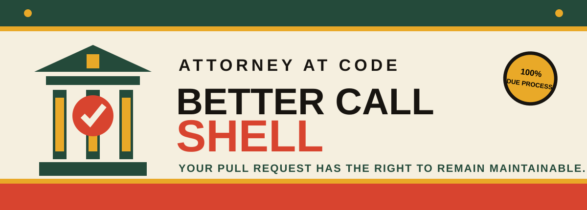
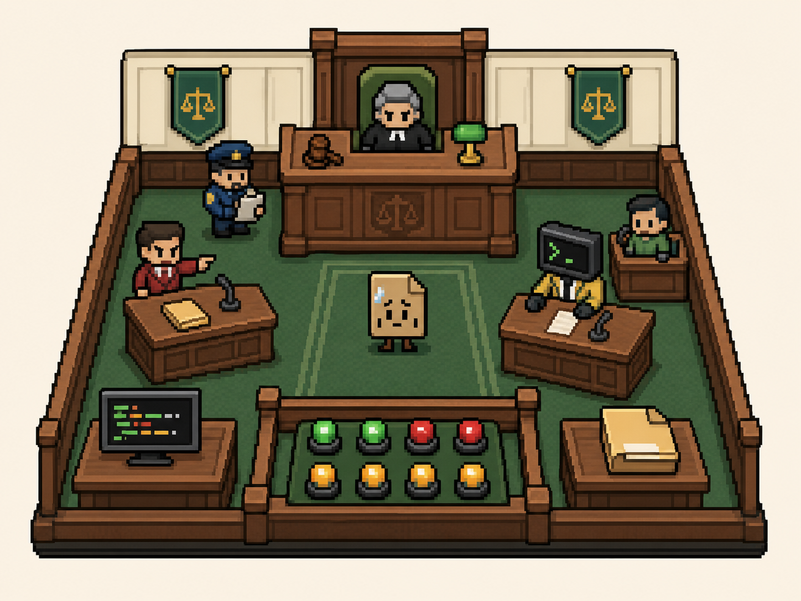
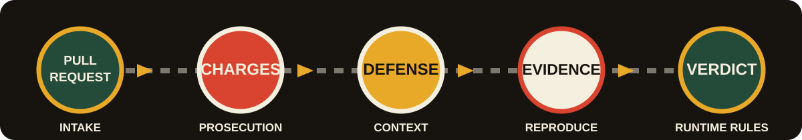

<div align="center">

<a href="https://better-call-shell.meerabalikhanpk.workers.dev/">
  
</a>

<br />

<a href="https://better-call-shell.meerabalikhanpk.workers.dev/"></a>
<a href="#-the-case"></a>
<a href="LICENSE"></a>

### ⚖️ Your pull request has the right to remain maintainable.

**An adversarial AI courtroom for code review.**  
The prosecution finds bugs. The defense checks the facts. The witnesses run the tests.  
**Judge Runtime believes evidence—not vibes.**

[**TRY THE LIVE COURTROOM →**](https://better-call-shell.meerabalikhanpk.workers.dev/)

</div>

---

## 🚨 Court is now in session

Most automated code review is one very confident robot leaving twelve comments
and disappearing before anyone can ask a follow-up question.

**Better Call Shell puts every accusation on trial.**

A prosecutor can file a charge against your diff—but a defense agent gets to
challenge it. Specialist witnesses reproduce the alleged failure. The repository
history establishes intent. And no finding becomes a verdict until **Judge Runtime**
sees actual evidence.

> [!IMPORTANT]
> **No stack trace? No failing test? No reproducible request? No conviction.**  
> “It feels risky” is not admissible evidence in this court.

<div align="center">
  
  <br />
  <sub><b>Exhibit A:</b> the runtime courtroom. Tiny lawyers. Real evidence. Extremely serious lint.</sub>
</div>

---

## 🗂️ The case

```text
THE PEOPLE OF PRODUCTION
             v.
PULL REQUEST #404

CHARGES
  01  Reckless null handling
  02  First-degree race condition
  03  Possession of an unindexed query
  04  Intent to distribute technical debt
```

Better Call Shell is a visual prototype for a GitHub App that turns pull-request
review into a structured, adversarial hearing instead of a flat list of guesses.
Every charge must survive opposing counsel and a reproducibility check.

<div align="center">
  
</div>

| Stage | Who takes the floor | What actually happens |
|:--|:--|:--|
| **① Intake** | Court Clerk | Reads the diff, issue context, changed files, and repository rules. |
| **② Charges** | The Prosecutor | Identifies concrete defects, regressions, security risks, and suspicious shortcuts. |
| **③ Defense** | Shelly Goodman | Challenges assumptions using intent, compatibility, history, and scope. |
| **④ Evidence** | Expert Witnesses | Runs tests, requests, benchmarks, traces, and targeted reproductions. |
| **⑤ Verdict** | Judge Runtime | Sustains, dismisses, settles, or declares a mistrial for human review. |

---

## 🎭 Meet the legal team

| | Counsel | Docket responsibility |
|:--:|:--|:--|
| 🟡 | **Shelly Goodman** | Defense counsel for the diff. Finds context before your code gets sentenced. |
| 🟢 | **Judge Runtime** | Accepts reproducible evidence and has never approved “trust me, bro.” |
| 🔴 | **The Prosecutor** | Files precise charges against risky behavior introduced by the change. |
| 🔵 | **Officer Lint** | Treats an unused import like a matter of national security. |
| ⚪ | **The Jury** | Your real test suite. Unimpressed by persuasive markdown. |

> **Shelly Goodman, Attorney at Code**  
> *Did you know your diff has rights? The linter says it does. And so do I.*

---

## 🔨 Possible verdicts

<div align="center">

| **SUSTAINED** | **DISMISSED** | **SETTLED** | **MISTRIAL** |
|:--:|:--:|:--:|:--:|
| 🔴 Fix before merge | 🟢 Claim disproved | 🟡 Safe patch agreed | ⚪ Human judgment needed |

</div>

The goal is not to generate more comments. The goal is to produce **fewer,
stronger, inspectable findings** that a maintainer can trust.

---

## ✨ Why this should exist

- **False positives get cross-examined.** A second agent must challenge every charge.
- **Evidence travels with the verdict.** Tests, traces, screenshots, and requests stay attached.
- **Old debt stays off the docket.** The court reviews what the pull request introduced.
- **Severity has a burden of proof.** A blocking verdict needs blocking evidence.
- **Humans remain the court of final appeal.** Automation argues; maintainers decide.

> [!NOTE]
> This repository currently contains the polished, interactive product prototype:
> a responsive pixel courtroom, live case docket, clickable charges, changing
> rulings, and case-intake flow. The GitHub App and isolated evidence runners are
> the next engineering milestone.

---

## 🏛️ Run the courthouse locally

**Requirements:** Node.js 22.13+

```bash
git clone https://github.com/meerabalykhan/better-call-shell.git
cd better-call-shell
npm install
npm run dev
```

Then visit the local address printed in your terminal.

```bash
npm run build   # production build
npm run lint    # courtroom procedure check
```

---

## 🗺️ On the docket

- [x] Interactive courtroom and case docket
- [x] Charge selection and changing rulings
- [x] Pull-request intake experience
- [x] Responsive pixel-art visual system
- [ ] GitHub App installation and webhook intake
- [ ] Diff-aware prosecution and defense agents
- [ ] Isolated test and reproduction runners
- [ ] Evidence bundles posted back to pull requests
- [ ] Human appeal, override, and audit trail

---

## 🎨 Court-approved colors

<div align="center">

| Courthouse | Counsel | Verdict | Legal paper | Court ink |
|:--:|:--:|:--:|:--:|:--:|
| 🟩 `#244A3A` | 🟨 `#E9A928` | 🟥 `#D8442F` | ⬜ `#F5EFDF` | ⬛ `#171410` |

</div>

The visual language is deliberately warm, tactile, and a little theatrical:
**municipal courthouse signage meets a late-night legal commercial meets a tiny
pixel game you absolutely should not be playing during code review.**

---

## 📜 The courtroom rules

1. **No charge without evidence.**
2. **Existing technical debt is not a new offense.**
3. **Style preferences are not defects.**
4. **Every automated decision must be inspectable.**
5. **The human maintainer may overrule the court.**

---

<div align="center">

### Better Call Shell

**When your diff is in trouble, you don't need another chatbot. You need counsel.**

[Website](https://better-call-shell.meerabalikhanpk.workers.dev/) · [Report an issue](https://github.com/meerabalykhan/better-call-shell/issues) · [MIT License](LICENSE)

<sub>An affectionate developer-tool parody. Not affiliated with Better Call Saul, AMC, Sony Pictures Television, or GitHub.</sub>

</div>
